# Single Source Shortest Path Algorithm for Dynamic Graphs

## Algorithms implemented (both for CPU and GPU) :

Static graphs : Modified Dijkstra, Bellman-ford

We got better performance on parallelised Dijkstra for static graphs as compared to Bellman-Ford hence we adapted Dijkstra for dynamic graph SSSP problem.

Dynamic graphs : Modified Dijkstra, Gradual algorithm (https://www.researchgate.net/publication/341712635_A_Single-Source_Shortest_Path_Algorithm_for_Dynamic_Graphs)

## Performance Analysis
### 1. Static Dijkstra Algorithm
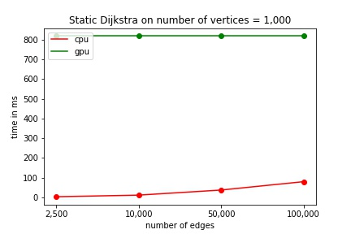 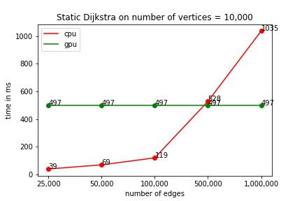 
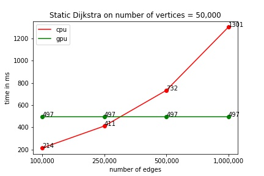 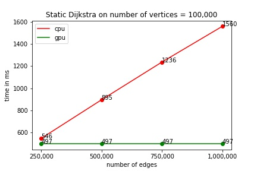
### 2. Static Bellman Ford Algorithm
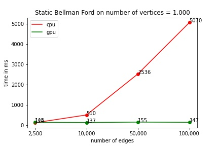 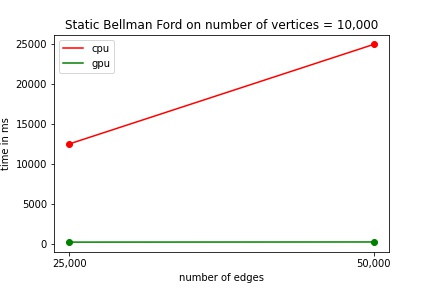

### 3. Dynamic Dijkstra Algorithm
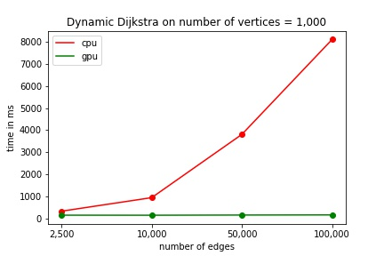 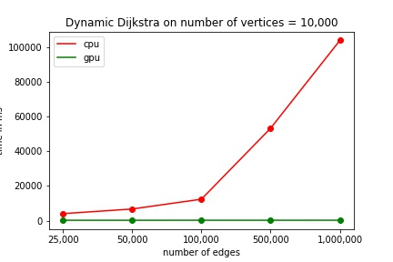 
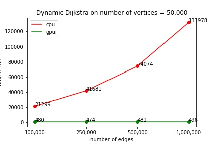 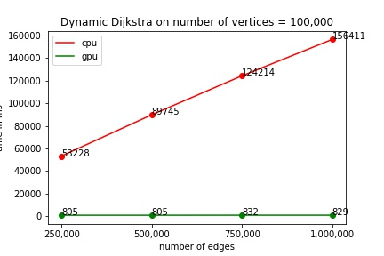

### 4. Dynamic Gradual Algorithm
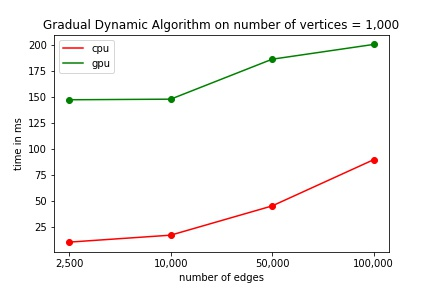 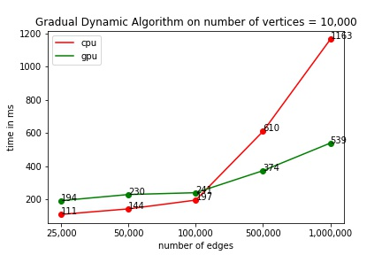 
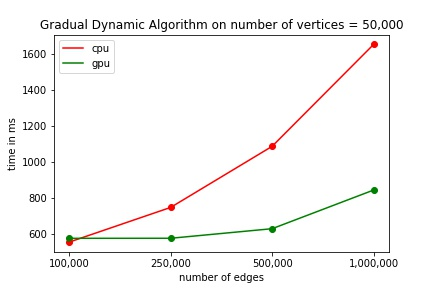 

## References 
```
[1] Alshammari, Muteb & Rezgui, Abdelmounaam. (2020). A Single-Source Shortest Path Algorithm for Dynamic Graphs. AKCE International Journal of Graphs and Combinatorics. 17. 10.1016/j.akcej.2020.01.002. 
```
