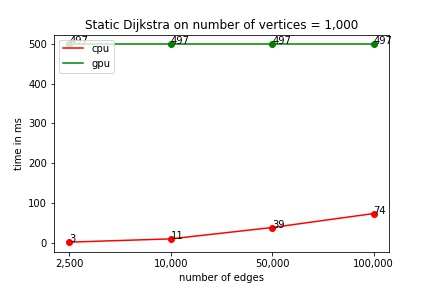
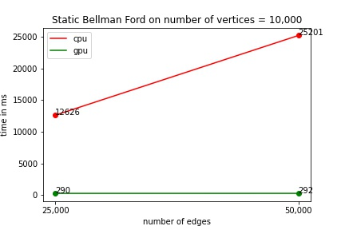
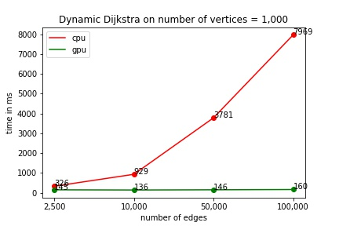
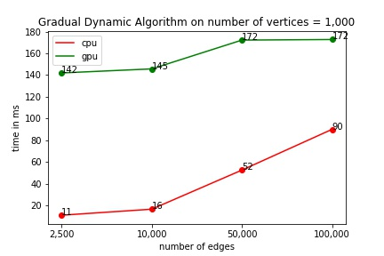
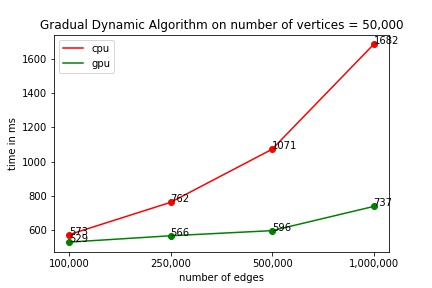

# Single Source Shortest Path Algorithm for Dynamic Graphs

## Algorithms implemented (both for CPU and GPU) :

Static graphs : Modified Dijkstra, Bellman-ford

We got better performance on parallelised Dijkstra for static graphs as compared to Bellman-Ford hence we adapted Dijkstra for dynamic graph SSSP problem.

Dynamic graphs : Modified Dijkstra, Gradual algorithm (https://www.researchgate.net/publication/341712635_A_Single-Source_Shortest_Path_Algorithm_for_Dynamic_Graphs)

## Compilation Instruction 
```
git clone https://github.com/IITJ-CSE/csl7520-project-tanmay-venkatesh.git
cd csl7520-project-tanmay-venkatesh
chmod a+x build.sh
./build.sh
```

## To profile GPU vs CPU performace of a algorithm
From the root of project repo run,
```
python profiler/profile.py -n <number of nodes> -m <number of edges> -q <number of changes to graph> --algo <algo-id>
```
You can use following command to get more help,
```
python profiler/profile.py --help
```


## Performance Analysis

The general trend we observed is, as the number of nodes and edges increases, CPU takes a lot more time in comparison to GPU.
The CPU version of gradual dynamic algorithm is faster than than dynamic Dijkstra, however the parallelised GPU implementation of the same is a bit slower than that of dynamic Dijkstra. That's because a few relatively cheap computations involved in gradual algo need to happen strictly in a sequential fashion.

### 1. Static Dijkstra Algorithm
  
 
### 2. Static Bellman Ford Algorithm
 

### 3. Dynamic Dijkstra Algorithm
  
 

### 4. Dynamic Gradual Algorithm
  
 

## References 
```
[1] Alshammari, Muteb & Rezgui, Abdelmounaam. (2020). A Single-Source Shortest Path Algorithm for Dynamic Graphs. AKCE International Journal of Graphs and Combinatorics. 17. 10.1016/j.akcej.2020.01.002. 
[2] https://www.academia.edu/11928177/Parallel_Implementation_of_the_Single_Source_Shortest_Path_Algorithm_on_CPU_GPU_Based_Hybrid_System
```
